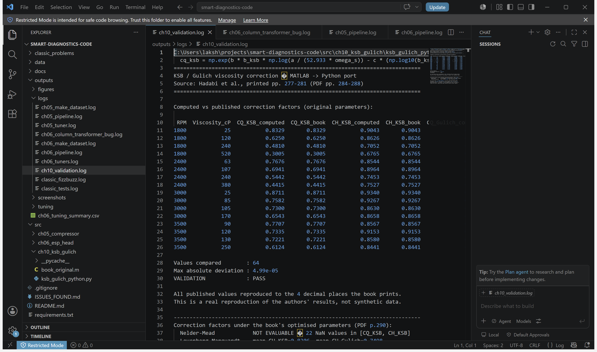
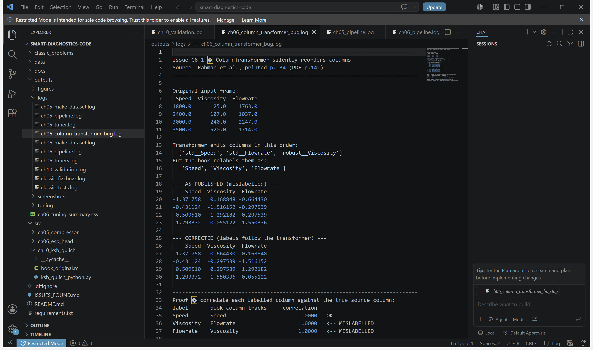

# Smart Diagnostics and Predictive Maintenance — code, run and audited

Every code listing from *Smart Diagnostics and Predictive Maintenance* (ed. Aydin Azizi,
Springer, *Emerging Trends in Mechatronics*), extracted, made runnable, executed, and
audited — plus a classic-problems module.

All 293 pages were scanned for code. Three chapters contain listings; the rest of the
"MATLAB" hits were prose mentioning MATLAB, not code.

| # | Chapter | Printed pp. | PDF pp. | Language | Status |
|---|---------|-------------|---------|----------|--------|
| 5 | Data-Driven Condition Monitoring of Reciprocating Compressors — Al-Obaidani et al. | 98–100 | 105–107 | Python / Keras | runs on synthetic data |
| 6 | AI Model to Estimate the Head of an ESP — Rahman et al. | 134–137 | 141–144 | Python / Keras | runs on synthetic data |
| 10 | Parameter Identification of Empirical Models for Head Estimation — Hadabi et al. | 277–280 | 284–287 | MATLAB | **ported to Python and numerically validated** |

> Page-number note: the book's printed numbers are offset from PDF page indices by 7.
> Printed p.98 is PDF p.105.

---

## The honest summary

**One result here is a real reproduction. The rest are demonstrations that the code runs.**

- **Chapter 10 is verified.** The book prints both its model inputs and the correction
  factors it computed from them (printed p.281). The Python port reproduces **all 64
  published values to 4 decimal places**, max deviation 4.99e-05. That is a genuine
  reproduction.
- **Chapters 5 and 6 are not, and cannot be.** Neither ships its dataset — one points at
  a private Google Drive path, the other at a bare `dataset.csv`. Their pipelines run
  here on **synthetic data**, so every accuracy/MAE figure below describes the data
  generator, not the authors' equipment. They are not comparable to the published
  results and are never presented as such.

Seven issues were found, including two silent ones that produce wrong numbers without
any error: a transposed-column bug in Chapter 6, and a parameter set in Chapter 10 that
takes the published formula outside the real numbers.
See [ISSUES_FOUND.md](ISSUES_FOUND.md).

---

## Layout

```
src/
  ch05_compressor/
    book_original.py            verbatim transcription (does not run — that is the point)
    make_dataset.py             synthetic data generator
    pipeline.py                 preprocessing + MLP + evaluation
    tuner.py                    keras-tuner Bayesian search
  ch06_esp_head/
    book_original.py            verbatim transcription
    make_dataset.py             synthetic data, physics-shaped
    column_transformer_bug.py   demonstrates issue C6-1
    pipeline.py                 MLP + FCC models
    tuners.py                   RandomSearch vs BayesianOptimization
  ch10_ksb_gulich/
    book_original.m             verbatim MATLAB
    ksb_gulich_python.py        Python port + validation against published tables
classic_problems/
  fizzbuzz.py                   FizzBuzz and relatives
  test_classic.py               13 tests
docs/PROMPT.md                  the brief this repo was built from
outputs/figures/                generated plots
outputs/logs/                   captured terminal output
ISSUES_FOUND.md                 the audit
```

Each module keeps a `book_original` file holding the listing exactly as printed —
original typos included — so the audit can be checked against the source.

---

## Running it

Use a virtual environment — TensorFlow pulls in a large dependency tree and should not
go into a system Python.

Windows:

```bash
python -m venv .venv && .venv\Scripts\python.exe -m pip install -r requirements.txt
```

macOS / Linux:

```bash
python3 -m venv .venv && .venv/bin/python -m pip install -r requirements.txt
```

Then run the modules with the venv's interpreter (`.venv\Scripts\python.exe` on Windows,
`.venv/bin/python` elsewhere) — shown below as `python` for brevity.

```bash
python src/ch10_ksb_gulich/ksb_gulich_python.py
```

```bash
python src/ch05_compressor/make_dataset.py
python src/ch05_compressor/pipeline.py
python src/ch05_compressor/tuner.py
```

```bash
python src/ch06_esp_head/make_dataset.py
python src/ch06_esp_head/column_transformer_bug.py
python src/ch06_esp_head/pipeline.py
python src/ch06_esp_head/tuners.py
```

```bash
python classic_problems/fizzbuzz.py
python classic_problems/test_classic.py
```

Environment used: Windows 11, Python 3.13.5 in a venv, TensorFlow 2.21.0, Keras 3.15.1,
keras-tuner 1.4.8, scikit-learn 1.9.0, numpy 2.5.1, pandas 3.0.5, matplotlib 3.11.1.
The book's Chapter 6 ran on Python 3.11.13 / TF 2.18.0 / Keras 3.8.0 (printed p.133).

---

## What each part produces

### Chapter 10 — validated port

Reproduces the book's published correction factors exactly:

```
Values compared        : 64
Max absolute deviation : 4.99e-05
VALIDATION             : PASS
```

The KSB and Gülich viscosity models are translated from MATLAB and vectorised over
operating points; the arithmetic is unchanged. The optimisation drivers (`fminsearch`,
`lsqnonlin`) cannot be re-run because their three input spreadsheets are not
distributed — only the model core, which is what the published tables let us check.

Running it also surfaces issue **C10-1**: the book's published Nelder–Mead parameters
(`a = 0.125`) drive the KSB term `B` below 1 for 11 of the 16 operating points, so
`(log10(B))^3.466` leaves the real numbers. numpy reports NaN; MATLAB silently returns
a complex number, which is likely why it went unnoticed.

### Chapter 5 — compressor fault classification

The architecture is exactly as printed: `20 → Dense(41, relu) → Dense(21, relu) →
Dense(4, sigmoid)`, binary cross-entropy, Adam, multi-label over bearings / water pump /
radiator / discharge valve.

On synthetic data: 0.920 per-row accuracy and 0.947 macro F1. Bayesian tuning selected
(28, 14) units against the baseline (41, 21) — 988 parameters against 1831, a 42.4%
reduction, close to the chapter's "reduced the number of parameters by almost half"
(printed p.97). The echo is qualitative only; the data is invented.

### Chapter 6 — ESP head estimation

Both published architectures: the MLP, and the FCC where every hidden layer sees the
input and all previous hidden layers.

| model | params | MAE (ft) | RMSE (ft) | MAPE | R² | within ±10% |
|-------|--------|----------|-----------|------|-----|-------------|
| MLP | 161 | 0.868 | 1.242 | 3.53% | 0.993 | 93.3% |
| FCC | 204 | 0.543 | 0.694 | 2.42% | 0.998 | 98.3% |

FCC beating MLP on raw error matches the chapter's own observation (printed p.133) —
again, qualitative agreement on synthetic data, not a reproduction.

> **On reproducibility.** The book seeds its train/test split but not TensorFlow's weight
> initialisation, so its network results cannot be reproduced run-to-run — the figures
> above moved on every retrain before being pinned. Everything here is now seeded
> (`keras.utils.set_random_seed`, plus `seed=` on both tuners), so every number in this
> README and in `outputs/logs/` comes back exactly on a rerun; each was verified by
> running twice and diffing.
>
> The two tuner algorithms get *distinct* fixed seeds. Sharing one seed makes
> RandomSearch and BayesianOptimization walk the same trial sequence and return
> byte-identical results at this small budget — a fake agreement. With 10 trials over a
> 2-hyperparameter space the comparison between the two is illustrative only; the
> chapter used 150 trials.

The synthetic generator is not noise: it uses the pump affinity laws, which the book's
own BEP table obeys exactly (1388.6 × 3500/1800 = 2700.0 against the book's 2700), and
applies viscous degradation using the *validated* KSB correction factor from Chapter 10.

### Classic problems

FizzBuzz in three forms — the naive branch version, a rule-driven version where adding
a divisor is data rather than a new branch, and an unbounded generator — plus Fibonacci,
primes, palindromes, two-sum, word reversal and anagrams. 13/13 tests pass.

---

## Screenshots

Captured from VS Code on the machine that ran the code (`outputs/screenshots/`).

**Chapter 10 validation — all 64 published values reproduced, `VALIDATION: PASS`**



**Issue C6-1 proven — the book's "Viscosity" column tracks Flowrate at correlation 1.0000**



Also in `outputs/screenshots/`: compressor training output, the MLP-vs-FCC comparison,
the 13/13 test run, and the ported KSB/Gülich source.

Plot output is in `outputs/figures/` and terminal transcripts in `outputs/logs/`.

---

## The bug worth knowing about

Chapter 6 builds a `ColumnTransformer` that scales `["Speed", "Flowrate"]` and
`["Viscosity"]` in that order, then labels the output `["Speed", "Viscosity",
"Flowrate"]`. `ColumnTransformer` emits columns in transformer order, so **Viscosity and
Flowrate are transposed**. Nothing raises; training converges; the labels are simply
wrong.

`python src/ch06_esp_head/column_transformer_bug.py` proves it by correlating each
labelled column against its true source:

```
label       book column tracks     correlation
Speed       Speed                       1.0000   OK
Viscosity   Flowrate                    1.0000   <-- MISLABELLED
Flowrate    Viscosity                   1.0000   <-- MISLABELLED
```

Full write-up in [ISSUES_FOUND.md](ISSUES_FOUND.md).

---

## Licence and attribution

The code in `book_original.*` is reproduced from the published book for study and audit,
and remains the property of its authors and Springer. Everything else — the runnable
adaptations, generators, validation harness, tests and audit — is MIT licensed.
